> 应用名: 爱深大
> =
> 包名: com.teleostnacl.szu
> =
>
> 下载链接
> 1. github: https://github.com/teleostnacl/LoveSzu
> 2. 百度网盘: https://pan.baidu.com/s/11Q4AsIDe780RgeFL-hmpUw?pwd=pwt6 提取码: pwt6

**历时一年时间, 经过数次重构, 比对不同框架, 推翻多种方案, 去繁从简, 推陈出新, 最后良心打造, 倾情奉献, 带来一款安卓应用 《爱深大》App, 为在深大的大家提供一些便捷的校园服务**

> 当前已有的功能
> 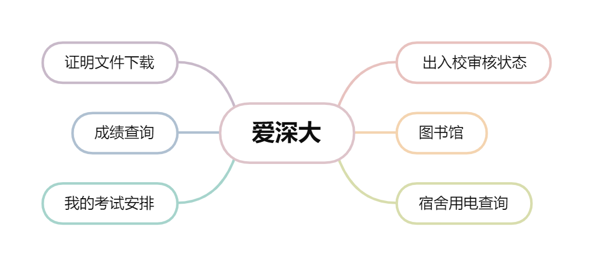
> - 出入校审核状态
> - 图书馆
> - 宿舍用电查询
> - 我的考试安排
> - 成绩查询
> - 证明文件下载
>
> 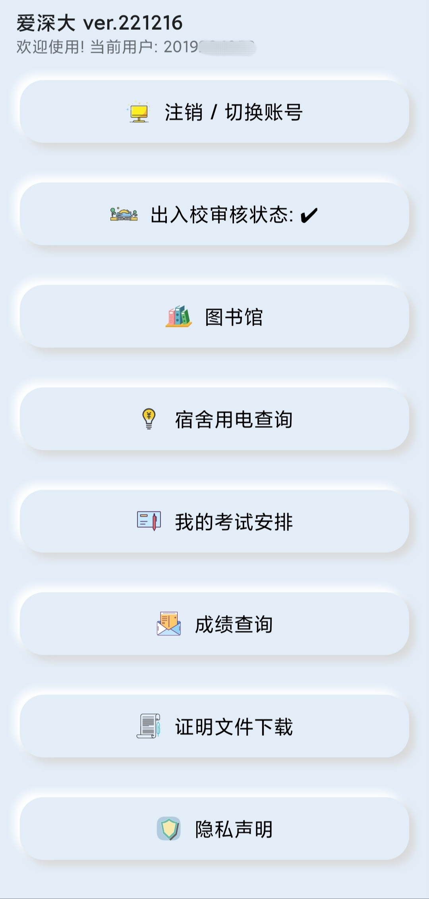

# (零) 我写这个应用的初衷

> 大概一年前, 某天在图书馆借书时, 拿着手机用图书馆网页寻找自己需要的书籍的时候, 感觉到非常的不方便, 不禁感概, 为什么图书馆不能出一个适合手机操作的移动端呢?
>
>于是乎, 一个想法就冒了上来: 为什么不自己写一个Android APP呢? 从图书馆网页获取数据, 再设计一套UI, 使网页内容呈现在App中, 以致可以在手机上方便浏览操作. 并且, 既然可以实现图书馆的功能, 为何不把那一套只适合在电脑端操作的办事大厅的一些常用功能也写进App呢?
>
> 于是乎, 带着将学校一些常用功能的网页, 转换成适合手机显示页面的想法, 开始进行开发《爱深大》App了.

---

# (壹) 隐私声明

1. 本应用核心功能及原理是在应用中请求网页暴露出来的接口, 从而获取数据, 并将数据整理使用, 呈现在App页面中
2. 由于网页浏览的特性, 本应用会获取并使用**cookies**, 从而应用可从网页获取数据. 同时, 为方便使用, 应用将会将**cookies**信息**加密**存储到**本地**数据库中;
   同时, 所有储存在**本地**中的数据都会经过**加密**处理
3. 本应用会访问您的校园数据, 只会用于展示页面, 且仅有部分数据会储存在本地, **开发者在此承诺不会对任何数据及信息进行收集, 转存和传输**
4. **同意隐私声明并开始使用应用, 即表示您将授予应用使用数据, 由此产生的后果, 本应用及开发者将不承担任何责任**

---

# (贰) 注意事项

1. 由于安卓应用自身的安全性限制, 请确保安装来源 **安全可靠** , 谨防信息泄露;
2. 此为非官方应用, 敬请 **合理** 使用; 当内部网接口发生更新时, 应用的功能可能受 **影响** ; 当出现一直失败时, 则表示应用已 **不再兼容** 新接口;
3. 应用仅使用**本科生账号**通过测试, **不能**保证其它类型的账号可使用所有功能.
4. **本应用仅供学习交流使用, 任何个人及组织不得用于商业和非法用途, 违者责任自负**

---

# (叁) 登录/切换账号

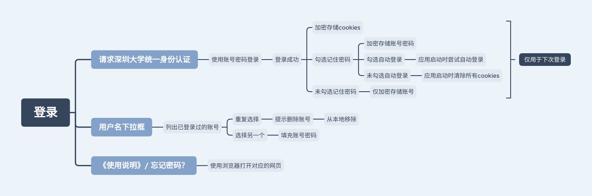
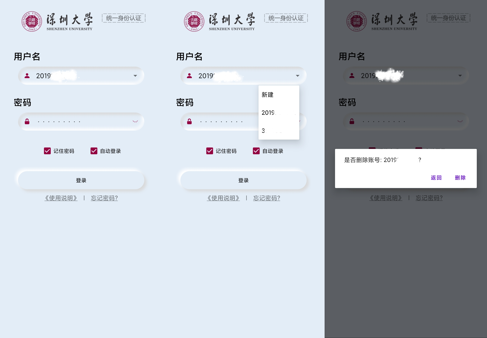

1. 登录模块请求的是`深圳大学统一身份认证`网页, 此处可直接使用账号密码进行登录, 应用将加密储存登录后的**cookies信息**, 并将被其他功能使用.

2. 当登录成功后, 应用将在**本地数据库**中**加密**存储已登录过的账号信息; 若勾选了记住密码, 则会同时将密码**加密**储存, 否则不存储密码

3. 勾选了自动登录后, 登录成功后每次应用启动都会进行尝试登录, 登录成功后则更新**cookies信息**; 若未勾选自动登录, 则启动应用时会清除应用的**所有cookies**,
   使应用处于未登录状态

3. 用户名的下拉框可选择已登录过的账号, 可快速选择登录其他账号; 若 _重复_ 选择当前的账号, 则会弹出提示框提示是否删除该账号(如第二张图 第三张图)

4. `《使用说明》` 和 `忘记密码?` 将会使用浏览器打开对应的网页

# (肆) 出入校审核状态

1. 出入校审核状态直接显示在主页中, 点击该项将使用浏览器打开`疫情防控信息平台`
2. 此项数据会在登录成功时访问`疫情防控信息平台`进行获取

# (伍) 图书馆

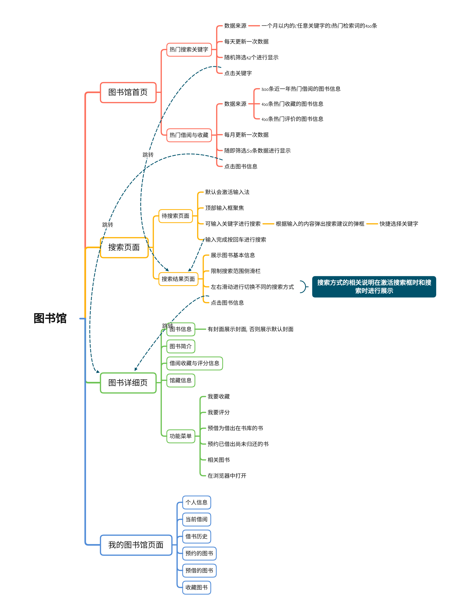

## 图书馆首页

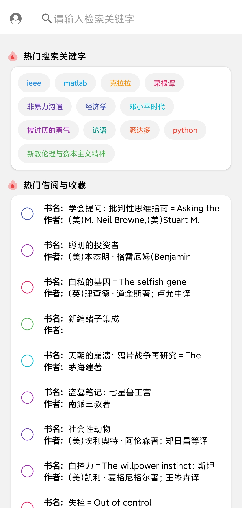

1. 将访问图书馆公共目录检索系统, 并获取热门检索词数据及热门借阅和收藏数据并<b>储存</b>在本地, 并在首页<b>展示</b>

- `热门搜索关键字`是从一个月以内的(任意关键字的)热门检索词的100条原始数据中, 随即筛选出12条数据用于展示. 原始数据每天更新一次, 并将数据存储在本地中.
- `热门借阅与收藏`的原始数据来源有三处, 共计500条图书信息, 从中筛选50条信息用于展示. 原始数据一个月更新一次, 并将数据储存在本地中.
    - 300条近一年热门借阅的图书信息
    - 100条热门收藏的图书信息
    - 100条热门评价的图书信息

2. 点击左上角`用户图标`, 将进入`我的图书馆页面`
3. 点击上方`搜索框`将进入图书搜索页面, 处于待搜索页面
4. 点击`热门搜索关键字`中的关键字将跳转至`图书搜索`页面, 处于搜索结果页面
5. 点击`热门搜索与收藏`中的图书项, 将会跳转至`图书详细页`

## 图书搜索页面

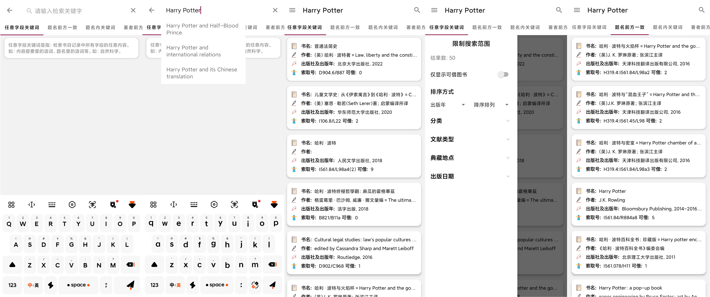

1. 进入图书搜索页面处于待搜索页面, 默认会激活输入法, 顶部输入框聚焦, 可输入关键字进行搜索(如第一张图)
2. 在输入框输入关键字时, 同时会根据输入的内容弹出搜索建议的弹框, 可快捷选择关键字(如第二张图)
3. 输入完成之后按回车进行搜索, 处于搜索结果页(如第三张图), 此处将展示图书核心信息(如第三张图)

- 点击搜索到的图书项, 将会跳转至`图书详细页`
- 当图书搜索完成时, 点击左上角更多按钮, 可展开`限制搜索范围`侧滑栏,
  可进行限制搜索范围进行搜索(如第四张图)
- 可左右滑动进行切换不同的搜索方式(如第五张图), 搜索方式的相关说明在激活搜索框时和搜索时进行展示(如第一张图 第二张图)

## 图书详细页

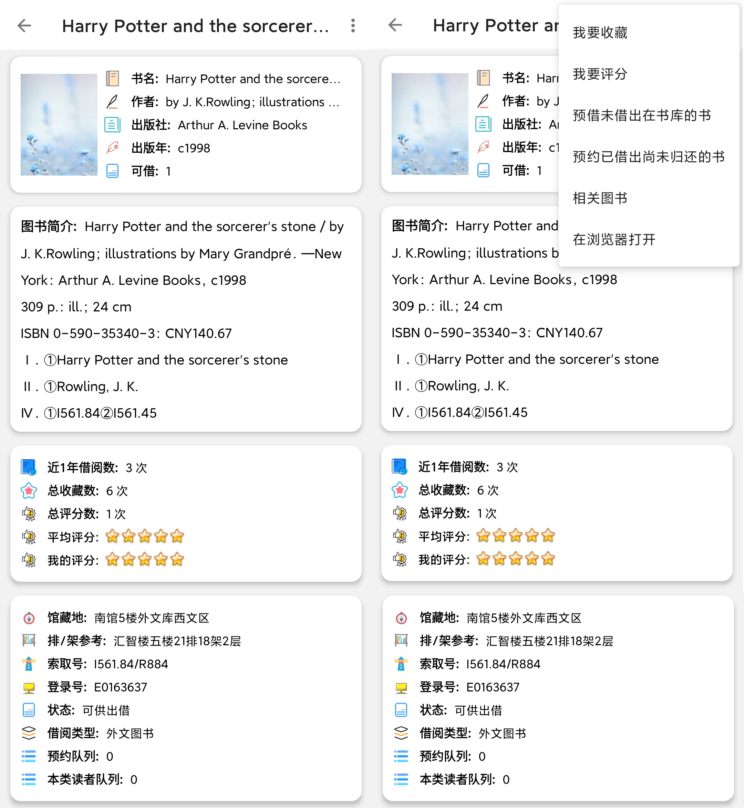

1. 图书详细页面将展示图书信息 图书简介 借阅收藏评分信息, 并最后展示所有馆藏信息, 可参考在图书馆寻书
2. 图书信息中, 如果图书有封面,则会展示相应的封面, 否则展示默认的封面
3. 点击右上角的菜单按钮, 弹出功能菜单, 实现不同功能

- 我要收藏: 将图书添加进收藏中, 可在我的图书馆 - 收藏图书查看
- 我要评分: 将弹出评分的对话框, 可选择分数对书籍进行评分
  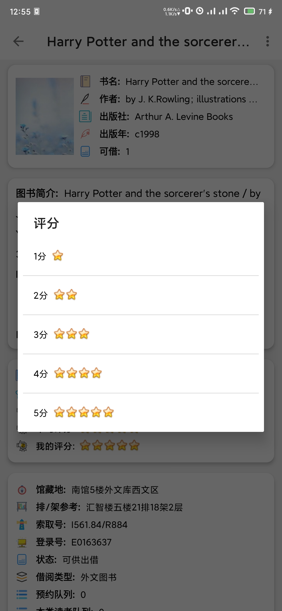
- 预借未借出在书库的书/预约已借出尚未归还的书: 跳转至预借/预约的页面, 可选择卷期, 取书地点, 并留下联系方式, 图书馆将会通过此联系方式与您取得联系
  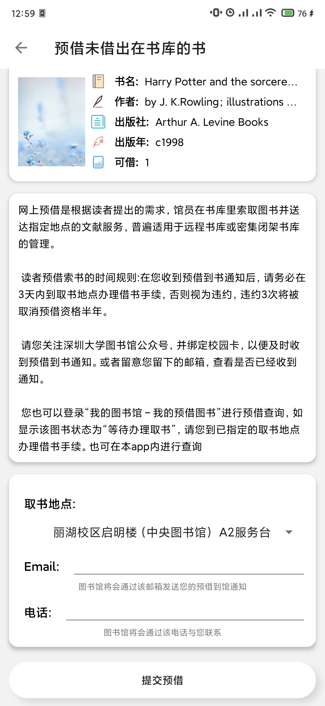
- 相关图书: 将会获取借阅此书的读者近一年来所借阅的其他相关图书, 点击相关图书, 将跳转至图书详细页
  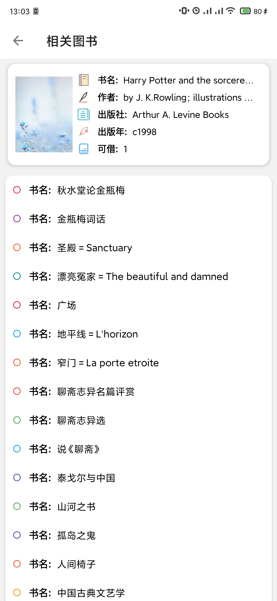

## 我的图书馆页面
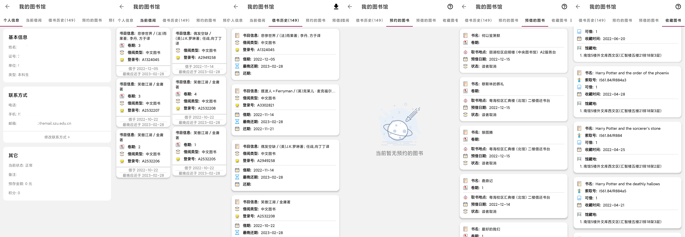
1. 个人信息页可展示用户信息, 联系方式, 状态, 可进行修改预留在图书馆中的联系方式, 图书馆将会通过此联系方式与您联系
2. 当前借阅将当前借阅的图书罗列出来, 并标准最晚还书日期. 若快到期或者已到期, 将会使用明显的颜色进行标示. 单击图书项可进入`图书详细页`(如第二张图)
3. 借书历史将会展示所有已借阅过的图书信息, 并计算总共借阅的图书数量, 标注在tab中. 单击图书项可进入`图书详细页`. 点击右上角的下载按钮将使用系统的下载管理器下载`荔园读书印记`(如第三张图)
4. 预约/预借的图书可展示当前预约/预借的图书信息, 并展示当前状态. 单击图书项可进入`图书详细页`, 长按可取消预约/预借. (如第四张图 第五张图)
5. 收藏图书将会展示所有已收藏的图书信息, 单击图书项可进入`图书详细页`, 长按可取消收藏. (如第六张图)

---

# (陆) 宿舍用电查询

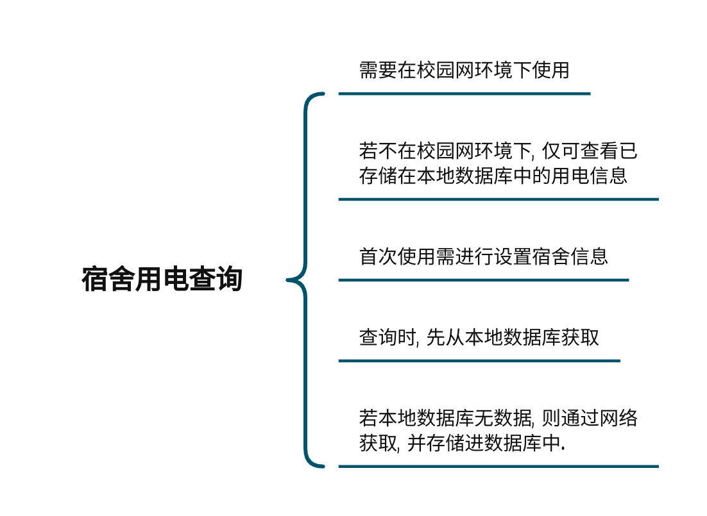

1. 宿舍用电查询需要在校园网环境下使用, 若不在校园网环境下, 仅可查看已存储在本地数据库中的用电信息
2. 首次进入将会弹出对话框提示设置查询用电的宿舍信息, 之后会利用该信息去获取用电信息, 并将信息展示在标题中
3. 查询用电信息时, 先从本地数据库获取, 若本地数据库无数据, 则通过网络获取, 并存储进数据库中.
4. 列表将展示用电信息, 单击可查看详细信息.
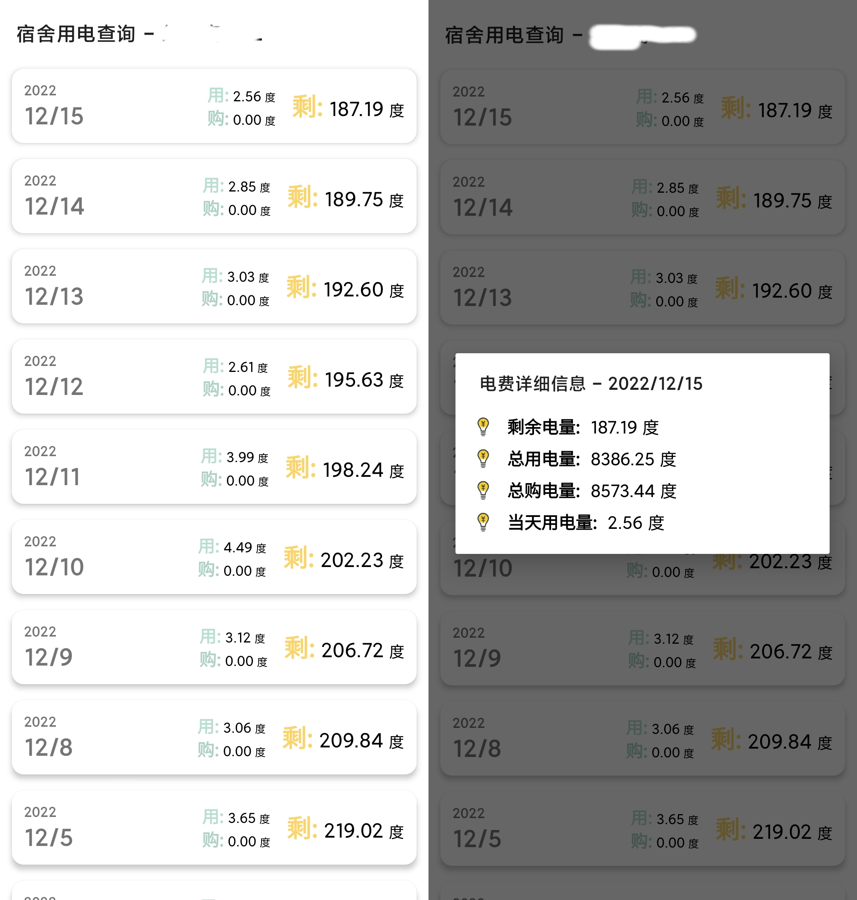

---

# (柒) 我的考试安排/成绩查询
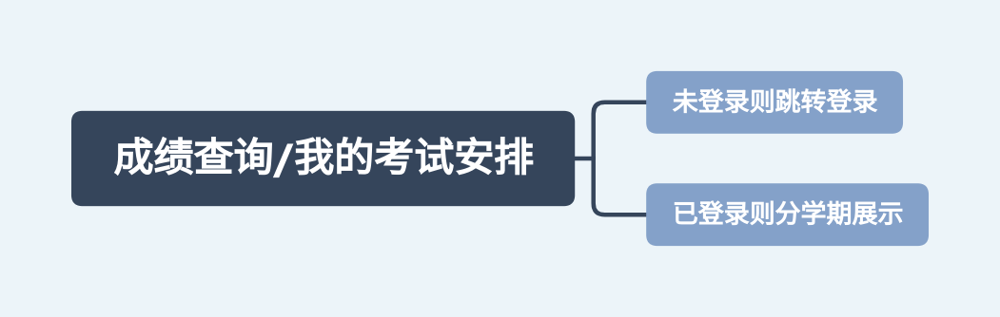
1. 登录状态下进入可直接获取考试安排数据/成绩, 否则将跳转至登录页面. 
2. 将分学期进行展示考试安排/成绩, 可展示考试时间与考试地点/绩点

---

# (玖) 证明文件下载
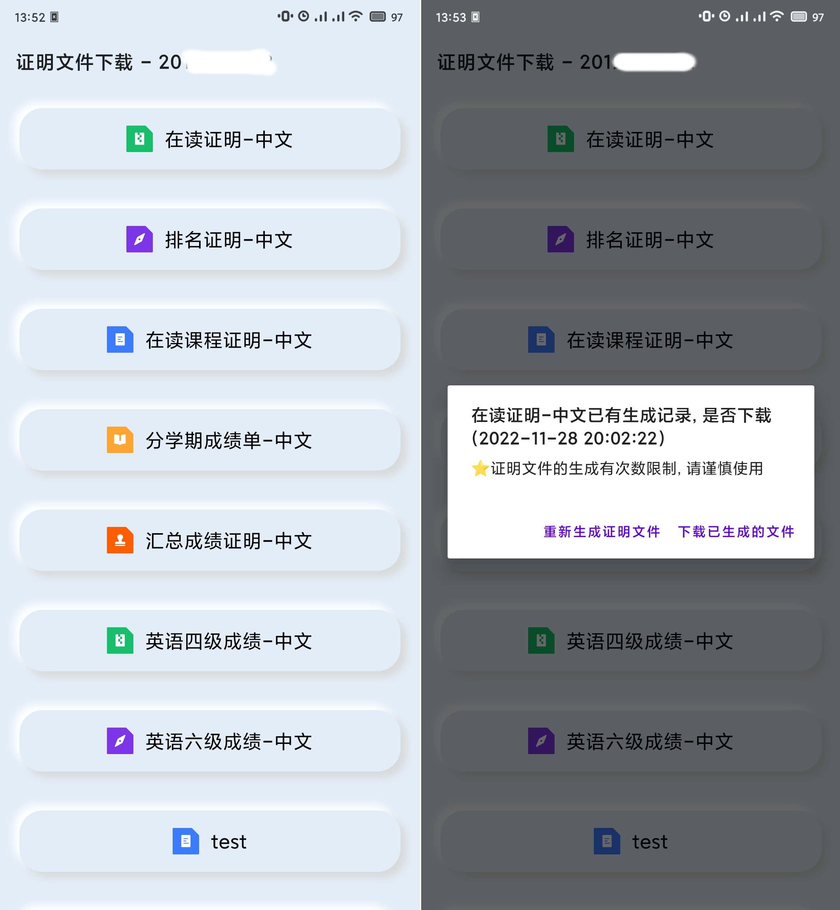
1. 将请求助打印移动办理平台页面, 获取学号并展示在标题中. 获取当前可下载的证明文件列表, 并获取已生成的证明文件
2. 点击需下载的证明文件, 将弹出对话框, 若已有已经生成的证明文件, 询问是否下载该证明文件. 
3. 生成证明文件的次数有限制, 请勿过度的重复生成证明文件.

---
# (拾)
>❤❤❤ 最后, 愿此App将能给您带来一些帮助与便利
